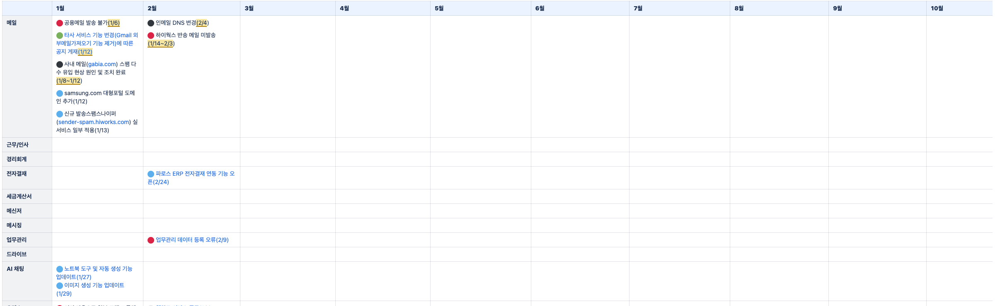

# 📆 연간 업무 플래너

업무 카테고리별로 연간 일정을 한눈에 관리하는 웹 애플리케이션입니다.



---

## 주요 기능

### 업무 항목 관리
- 카테고리 × 월 셀에서 업무 항목 **추가 / 수정 / 삭제**
- **단일 날짜** 또는 **기간(범위)** 설정 가능
- **하이라이트** 표시로 중요 항목 강조
- 항목 클릭 시 수정 모달 열림
- 항목 호버 시 삭제 버튼 노출 (확인 다이얼로그 포함)

### 색상 태그 (6가지)

| 색상 | 용도 | Hex |
|------|------|-----|
| 🔴 빨강 | 오류 / 장애 | `#ef4444` |
| 🟠 주황 | 이슈 | `#f59e0b` |
| 🟢 초록 | 공지 / EMS | `#22c55e` |
| 🔵 파랑 | 오픈 / 개편 / 기능추가 | `#3b82f6` |
| ⚪ 회색 | 종료 | `#9ca3af` |
| ⬛ 진회색 | 팀 내부 이슈 | `#374151` |

### 카테고리 관리
- 카테고리 **추가 / 이름 수정 / 삭제**
- 카테고리 셀 호버 시 편집 버튼 표시
- 등록 순서 유지

### UI / UX
- **라이트 모드 / 다크 모드** 토글 (선택값 `localStorage` 저장)
- **월별 컬럼 너비 조절** — 헤더 경계선을 드래그해 리사이즈 (최소 80px, `localStorage` 저장)
- 월 헤더에 계절 이모지 표시 (❄️ 💝 🌸 🌼 🌿 ☔ ☀️ 🏖️ 🌾 🍂 🍁 🎄)
- 현재 연도 자동 표시
- 로딩 스피너 및 에러 토스트 알림
- 하단 카테고리 / 업무 건수 요약 표시

---

## 기술 스택

| 분류 | 기술 |
|------|------|
| 프레임워크 | React 19 + TypeScript |
| 빌드 | Vite 6 |
| UI | MUI (Material UI) v7 |
| 날짜 | dayjs + MUI X Date Pickers |
| 서버 상태 | TanStack React Query v5 |
| 백엔드 / DB | Supabase (PostgreSQL + RLS) |
| 폰트 | Pretendard |

---

## 프로젝트 구조

```
src/
├── components/
│   ├── PlannerTable/
│   │   ├── PlannerTable.tsx    # 메인 테이블 + 헤더 영역
│   │   ├── TableHeader.tsx     # 월 헤더 + 컬럼 리사이즈
│   │   ├── CategoryRow.tsx     # 카테고리 행
│   │   └── WorkCell.tsx        # 월별 업무 셀
│   ├── EntryForm/
│   │   ├── EntryFormModal.tsx  # 업무 추가/수정 모달
│   │   ├── ColorPicker.tsx     # 색상 선택
│   │   └── DateInput.tsx       # 날짜 입력 (단일/범위)
│   ├── CategoryAddModal.tsx    # 카테고리 추가 모달
│   ├── CategoryEditModal.tsx   # 카테고리 수정 모달
│   ├── YearSelector.tsx        # 연도 선택
│   └── Toast.tsx               # 에러/성공 알림 토스트
├── hooks/
│   ├── useCategories.ts        # 카테고리 CRUD (React Query)
│   └── useWorkEntries.ts       # 업무 항목 CRUD (React Query)
├── lib/
│   └── supabase.ts             # Supabase 클라이언트
├── types/index.ts              # 타입 정의
├── constants/index.ts          # 색상·월 상수
└── App.tsx                     # 테마 (라이트/다크) + 루트
```

---

## DB 스키마

```sql
-- 카테고리
categories (
  id         uuid PK,
  name       text,
  order      integer,
  created_at timestamptz
)

-- 업무 항목
work_entries (
  id          uuid PK,
  category_id uuid FK → categories.id (CASCADE DELETE),
  year        integer,
  month       integer (1–12),
  color       text ('red'|'orange'|'green'|'blue'|'gray'|'dark'),
  text        text,
  date_type   text ('single'|'range'),
  date_value  text,   -- single 날짜
  date_from   text,   -- range 시작
  date_to     text,   -- range 종료
  highlight   boolean,
  created_at  timestamptz
)
```

- `work_entries(year, month)`, `work_entries(category_id)` 인덱스 적용
- Row Level Security(RLS) 활성화 (개발용 allow-all 정책)

---

## 시작하기

### 1. 환경 변수 설정

`.env` 파일을 생성하고 Supabase 프로젝트 정보를 입력합니다.

```env
VITE_SUPABASE_URL=https://your-project.supabase.co
VITE_SUPABASE_ANON_KEY=your-anon-key
```

### 2. DB 스키마 적용

Supabase SQL Editor에서 `supabase/schema.sql`을 실행합니다.

### 3. 의존성 설치 및 개발 서버 실행

```bash
npm install
npm run dev
```

### 4. 빌드

```bash
npm run build
```
